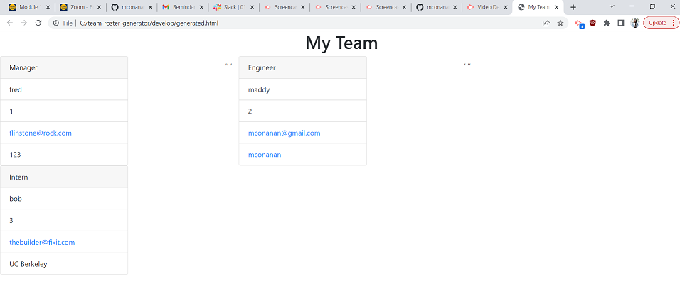

# team-roster-generator
command line application that creates an organized team roster

When the user runs node index in the command line, inquirer prompts them to add a manager. They are then prompted to answer questions on name, id, email, and office number. They are then prmopted to add an engineer, intern, or none. 

When engineer is selected in the command line, inquirer prompts the user to answer questions on the engineer's name, id, email, and github. Inquirer then returns to prompt them to add an engineer, intern, or none.

When intern is selected in the command line, inquirer prompts the user to answer questions on the intern's name, id, email, and school. Inquirer then returns to prompt them to add an engineer, intern, or none.

When none is selected, the application terminates and a .HTML page is created within the working directory. Once opened in browser, the page displays the team members in cards with clickable links to email and github.

Tests run on manager, engineer, and intern classes all pass.

link to screencastify: https://drive.google.com/file/d/16gPFzMwm28tIC1pJrpf9Fuqzp2s6seED/view

link to repo: https://github.com/mconanan/team-roster-generator